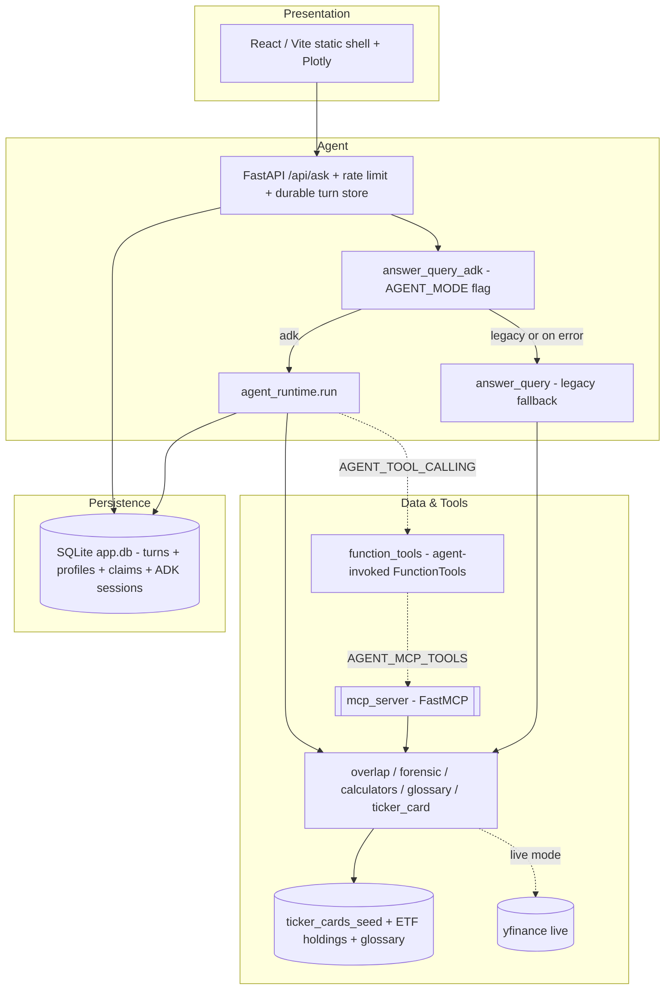
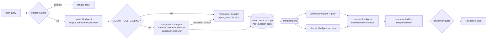
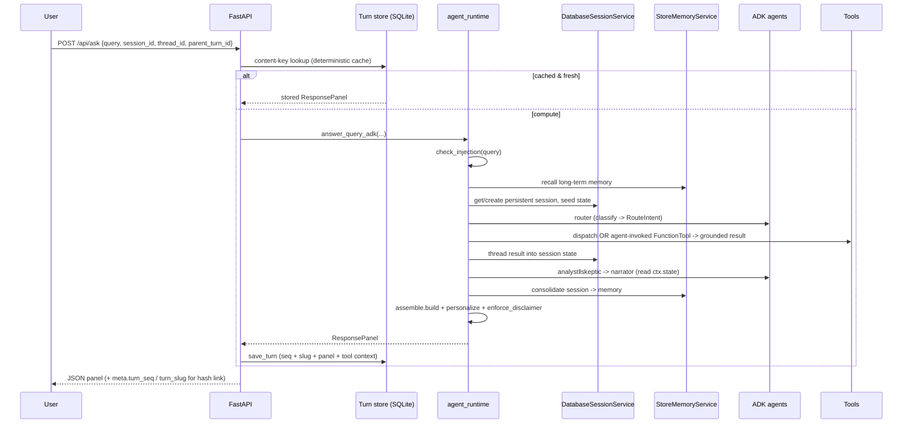
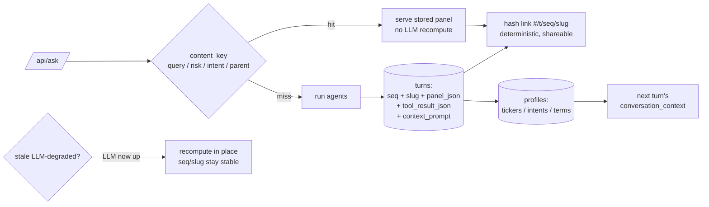
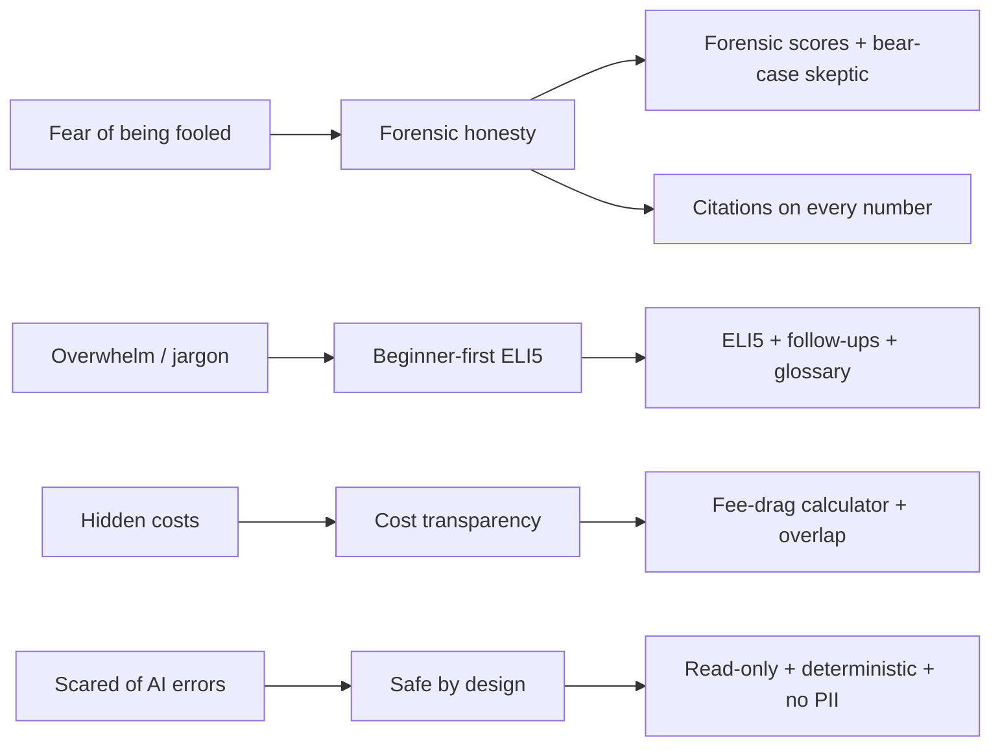
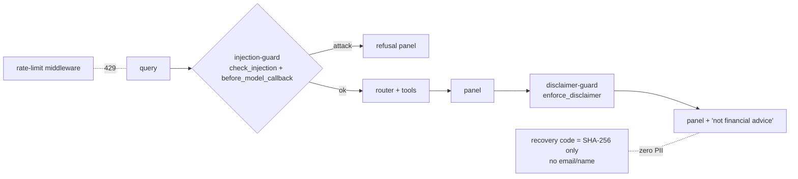

# Architecture

The product is an interactive research **panel** for beginner retail investors.
A question becomes a grounded `ResponsePanel` (charts + citations + pros/cons +
ELI5 + follow-ups). The agent layer is central: an ADK multi-agent replaces a
brittle regex router, while **deterministic tools own every number** so answers
stay citable and unit-tested. Context flows **through** persistent ADK Session
state and long-term Memory — not around it.

- **243 tests** (`uv run pytest`) — the deterministic core is fully covered.
- **~7 course concepts** backed by code (the rubric needs ≥ 3).

---

## 1. Three-layer architecture

## 2. ADK workflow graph (the core)

Router / analyst / skeptic / narrator are `LlmAgent`s with pydantic
`output_schema`s (structured output). **Tool computation is deterministic** — the
LLM only classifies intent and writes language. `analyst‖skeptic` is a real
`ParallelAgent`: the two are genuinely independent (the product principle is
"always show the case for and against"). When `AGENT_TOOL_CALLING` is on, the
`tool_caller` agent **itself** invokes an ADK `FunctionTool` (function calling),
optionally consuming the tools over **MCP**; the deterministic `dispatch()` stays
the fallback, so grounding never depends on the model choosing the right tool.

## 3. Request sequence (with sessions & memory)

## 4. Persistence & context (forum-style turn store)

Two decoupled stores share one SQLite file: the **turn store** (every answered
question as a forum "topic" — a deterministic `seq` + readable `slug`, chained by
`parent_seq` for follow-ups) and the **interest profile** (durable
personalization). A turn is keyed by `content_key`, so the same question in the
same context always maps to the same `seq` — links are deterministic and
shareable, and a reload never re-runs the LLM. A turn answered while the LLM was
down (`meta.llm_degraded`) is recomputed **in place** once an LLM is configured,
so a shared `#/t/<seq>` link upgrades itself instead of showing a stale fallback
forever. The persistent ADK `DatabaseSessionService` lives in the same file, so
Session state accumulates across the turns of a conversation.

## 5. Needs → Accents → Features

## 6. Security guardrails

Two layers of guarding: a structural **injection-guard** (both a pre-call
`check_injection` and an ADK `before_model_callback` on the router) and an output
**disclaimer-guard**. Rate-limiting protects the LLM-backed endpoints; multi-device
recovery stores only a code hash, so there is no PII to leak.

---

## Course-concept → file mapping

| Concept | Where in code | How it is used (not artificial) |
|---|---|---|
| Agent / Multi-agent (ADK) | `app/agent.py`, `app/agent_runtime.py` | router `LlmAgent` replaces the regex router; parallel analyst‖skeptic = product's for/against principle; narrator; deterministic assembler keeps grounding |
| Structured output | `output_schema` on router/analyst/skeptic/narrator; `contracts.RouteIntent/Pros/Cons/Narr` | validated JSON at each node |
| Agent tool use (function calling) | `app/function_tools.py`, `agent.build_tool_agent`, `agent_runtime._agent_tool_dispatch` (`AGENT_TOOL_CALLING`) | the `tool_caller` agent ITSELF invokes an ADK FunctionTool (forensic/overlap/ticker_card/fee_drag/glossary); result maps onto the same assemble path; `dispatch` stays the grounding fallback; `meta.tool_invoked` records the trajectory |
| MCP Server + client | `app/mcp_server.py` (server); `agent._mcp_toolset` via ADK `MCPToolset` (`AGENT_MCP_TOOLS`) | external FastMCP interface AND the agent optionally *consumes* those same tools over MCP instead of in-process |
| Sessions / Memory | persistent `DatabaseSessionService` (`agent_runtime`), `app/memory_service.py` (`StoreMemoryService`), `app/store.py` profiles | Session state threads across turns; cross-session Memory adapter; durable interest profile → personalized follow-up |
| Multi-device (no PII) | `store.create_claim/redeem_claim`, `/api/claim` + `/api/claim/redeem`, frontend recovery-code UI | recovery-code seam binds a guest id across devices; only the code hash is stored, zero PII |
| Security | `app/security.py`, `.semgrep/`, `.pre-commit-config.yaml`, `threat_model.md`, rate-limit in `server/main.py` | injection-guard + disclaimer-guard + rate-limit + semgrep + STRIDE |
| Evaluation | `eval/evalset.json`, `eval/run_eval.py` (`--judge`) | router accuracy + Agent-Quality LLM-as-judge (helpfulness/groundedness/safety) + trajectory (incl. agent-issued tool calls) |
| Agent skills | `.agents/skills/*`, `.agents/CONTEXT.md` | codified dev patterns + secure-coding standard |
| Deployability | `Dockerfile`, README (3 run modes), Cloud Run | one container, public URL |
| Grounding / citations | `Citation` on every number (tools) | LLM never invents numbers |
| ADK 2.x App form | `app/adk_app.py`, `agent.build_app` (`App(root_agent=…)`) | the graph is discoverable by `agents-cli` (playground / run / eval) |

---

## Backend screenshots

These evidence the "technically-real" claims — capture and drop into `docs/img/`.

<!-- SCREENSHOT GROUP: backend — Swagger, DB viewer, ADK playground, eval, tests, Cloud Run -->

  
  
  

  
  
  

- **Swagger** — `http://127.0.0.1:8000/docs` (the full API surface).
- **Database viewer** — `datasette app/data/app.db` shows the `turns`, `profiles`,
  and `claims` tables (forum-style records, zero-PII claim hashes) plus the ADK
  `sessions`/`events` tables.
- **ADK playground** — `agents-cli` discovers `app/adk_app.py` (`App(root_agent=…)`)
  and renders the router → analyst‖skeptic → narrator graph.
- **Eval** — `uv run python eval/run_eval.py --judge`.
- **Tests** — `uv run pytest` (243 collected).
- **Cloud Run** — the deployed service and its public URL.

---

## Evaluation result

`eval/run_eval.py` scores router accuracy over the intent set, plus an
Agent-Quality LLM-as-judge (helpfulness / groundedness / safety) and a trajectory
check that now includes agent-issued tool calls (`meta.tool_invoked`, e.g.
`[agent→forensic_screen]`). Misses degrade safely because `dispatch` falls back to
a valid generic/glossary panel.

## Design decisions

- **Flag + fallback (`AGENT_MODE`, `AGENT_TOOL_CALLING`, `AGENT_MCP_TOOLS`).** The
  deterministic baseline keeps running; every ADK path is additive and degrades to
  legacy on any error. Robustness and reviewability in one move.
- **LLM routes, tools compute.** Keeps every number citable and testable; the
  agent adds language and judgment, not arithmetic. This is a direct answer to the
  most-cited retail fear ("LLMs are bad at numbers → make it deterministic").
- **Context through ADK, not around it.** A persistent `DatabaseSessionService`
  threads state across turns; long-term `StoreMemoryService` feeds it — the
  Context-Engineering (Sessions & Memory) pattern from the course.
- **Deterministic, shareable links.** The turn store makes every answer a
  forum-style topic with a stable `#/t/<seq>` link and an auditable record of the
  exact context the LLM saw — no ad-hoc URL cramming, no nondeterministic recompute.
- **Seed catalog, not runtime cache.** Dense demo charts live in a committed
  `ticker_cards_seed/` (not the gitignored `.cache/`) so they survive the Docker
  build and Cloud Run.

## Presentation layer

The served frontend is a hand-written static shell in `frontend/dist/`
(`index.html` + `app.js` + `styles.css`) — no build step required to run it, which
keeps the container simple. Three upgrades sit on top, all vendored so they work
offline on Cloud Run:

- **Interactive charts — `frontend/dist/plotly.min.js`.** Block renderers
  (line/donut/heatmap/bar/treemap/radar) draw with Plotly (hover, real axes,
  click-through to a ticker card). If the bundle is missing they degrade to empty
  placeholders.
- **Risk-profile quiz — `app/personalize.py`.** A 3-question quiz
  (horizon / tolerance / goal) maps to a conservative | balanced | aggressive
  profile; `apply_risk_profile()` annotates the built `ResponsePanel` with a
  risk-framed assumption and an intent-specific honesty note. Framing only — the
  numbers, blocks and citations are untouched, so grounding is preserved.
- **Tailwind utilities — `frontend/dist/tailwind.css`.** A utilities-only Tailwind
  build (no preflight reset) compiled offline, layered after `styles.css` for
  rounded corners, soft shadows and hover lift without touching the working layout.
