# Product: from real needs to features

A beginner retail investor doesn't need another terminal of numbers. They need
help **not being fooled**, **not being overwhelmed**, and **not overpaying**.
This product is built *needs-first*: every feature traces back to something real
retail investors say they want — and the agent's job is to make professional-grade
rigor legible to a beginner.

> This is an educational capstone prototype, **not investment advice**. It is
> read-only: it informs, it never trades.

---

## 1. Who it's for

A first- or second-year retail investor who reads r/investing and r/Bogleheads,
has a brokerage account and a few thousand dollars, and is anxious about making
an expensive mistake. **Not** a trader, **not** an analyst. Someone who wants a
second opinion that shows its work — without a Bloomberg terminal, a login, or a
subscription.

This positioning targets the **Concierge** criteria: a personal, safe assistant
that analyses *your* holdings from public data only, keeps personal information
safe (no broker login, no PII), and frees time from routine due diligence.

---

## 2. The problem, in investors' own words

The needs were drawn from ~350 real retail-investor posts and comments (Reddit
r/investing, r/Bogleheads, r/ETFs, r/AI_Agents), plus a survey of consumer
finance SaaS/OSS. We looked for *what people ask for*, not for "cognitive biases
to save them from." Four themes recur — and they are strikingly reasonable:

| Theme (verbatim signal) | Real source |
|---|---|
| *"Give me one **free** place, **no sign-up**, to analyse my investments"* | ["I built a browser-based market terminal because I hate creating accounts for simple tools"](https://www.reddit.com/r/investing/comments/1pzvmk1/weekend_project_i_built_a_browserbased_market/) · ["Can anyone recommend a FREE tool to analyze my personal finances…"](https://www.reddit.com/r/AI_Agents/comments/1rmf19p/can_anyone_recommend_a_free_tool_to_analyze_my/) |
| *"**Explain it like I'm 5** — I'm new"* | ["Can you explain it to me like I'm 5? Late 30s passive investor…"](https://www.reddit.com/r/Bogleheads/comments/1qjxtte/can_you_explain_it_to_me_like_im_5_late_30s/) |
| *"Give me **numbers I can trust and verify** — I'm scared of AI errors"* | ["Luv 2 have AI do things for me where I can get prison time if there are errors"](https://www.reddit.com/r/investing/comments/1r1fd4f/wealthmanagement_stocks_fall_on_new_ai_fears/) · *"LLMs are bad at numbers… you really want most of your logic to be deterministic"* ([thread](https://www.reddit.com/r/algotrading/comments/1srw7oz/what_do_you_think_about_this_agent_set_up/)) |
| *"Cover **what I actually hold** — not just US stocks"* + *"a good write-up **answers questions you hadn't considered**"* | ["ETF Overlap and Analysis Tool" (153↑)](https://www.reddit.com/r/ETFs/comments/xrak3a/etf_overlap_and_analysis_tool/) · ["How do you find high-growth stocks early?"](https://www.reddit.com/r/investing/comments/1q0g8lo/how_do_you_find_highgrowth_stocks_early_rklb/) |

A recurring, product-defining fear is the price of an AI mistake:

> *"Being audited by the IRS for unusual activity and potential fraud due to a
> **hallucination** caused by a made-up tax exemption."* — r/investing

That single sentence is why **numbers in this product are computed by
deterministic tools and every one carries a citation** — the LLM writes language,
never arithmetic.

*(Bonus real-world hook for the forensic feature:*
["Nvidia Says It's Not Enron in Private Memo Refuting Accounting Questions" (780↑)](https://www.reddit.com/r/stocks/comments/1p5rneb/nvidia_says_its_not_enron_in_private_memo/) *— exactly the anxiety our forensic red-flag screen addresses.)*

---

## 3. Needs → Accents → Features

Features do not have to map 1:1 to a need; some are rarer picks we thought
beginners would value. But every one is *justified* by an accent that grew out
of the research.

| Need (why they're anxious) | Accent (our stance) | Feature (what they get) |
|---|---|---|
| "Am I being fooled by a hyped stock?" | **Forensic honesty** | Forensic scores (Altman Z / Beneish M / Piotroski F) with formula + citation, plus a **skeptic** bear-case on every answer |
| "I don't understand the jargon." | **Beginner-first** | ELI5 (2–3 plain sentences), a 1-line headline, "learn more" follow-ups, and clickable glossary term cards |
| "What are the hidden costs?" | **Cost transparency** | Fee-drag calculator over time; ETF **overlap** so you see you're paying twice for the same holdings |
| "Is this one source trustworthy?" | **Grounding** | A citation on every number (regulator > issuer > Wikipedia); honesty notes when data is cached |
| "Cover what I actually hold." | **Breadth** | Stocks + ETFs, look-through into real companies, sector/geo breakdowns |
| "Nobody's guiding me." | **Concierge** | Session + long-term memory of what you looked at → a personalized follow-up ("compare this with NVDA, which you looked at earlier") |
| "I'm scared of AI errors." | **Safe by design** | Read-only, public data only, deterministic math, injection-guard, disclaimer, no PII |

---

## 4. Why *this* agent, and why agents at all

**Why this agent.** The single most-requested thing was a free, no-login, honest
second opinion that a beginner can actually read. Nothing in the field combines
*grounded* numbers, a *balanced* for/against, *ELI5* framing, and *clickable*
drill-downs in one coherent product. That gap — plus the recurring fear of AI
getting numbers wrong — defines the agent: **verifiable, plain-language,
balanced, read-only.**

**Why agents (not a single prompt).** Answering a real investing question is a
multi-step, heterogeneous task: classify intent, pull the right grounded data,
argue the bull case *and* the bear case, then translate it for a beginner. A
single monolithic prompt collapses those into one voice and quietly drops the
counter-argument. Our multi-agent graph makes the counter-argument *structural*:
an **analyst** and a **skeptic** run in parallel as independent `ParallelAgent`
branches, so "what looks good" and "what to watch" are always both present — the
product principle a single prompt can't guarantee. The router classifies, the
tools compute, the narrator explains. Each role does one thing well.

---

## 5. The interaction: one panel, never a wall of text

Every question returns a single **`ResponsePanel`**, not paragraphs:

- a plain **headline** and **ELI5**,
- a few **visual blocks** (heatmap, treemap, donut, bar, line, radar/snowflake,
  traffic-light, percentile bar, scorecard, KPI),
- **pros** (analyst) and **cons** (skeptic) side by side,
- **citations**, **assumptions**, **honesty notes**, and
- **follow-ups** (deeper / wider / simpler) to keep learning.

Anti-overload is a rule, not a preference: ≤ ~6 blocks per answer, each with a
one-line takeaway. Tickers and terms in the prose are **underlined and
clickable** — click a ticker for a card with a 1-year chart, click a term for an
ELI5 glossary card with a regulator link.

---

## 6. The product in pictures & motion

Everything below is the real UI — nothing mocked up. Thumbnails open full-size;
the clips are screen-recordings of live sessions. Ordered the way you meet the
tools in the app.

### Screenshots

<!-- single-screen shots, menu order: landing → ticker → glossary -->

  <a href="img/landing-start.png">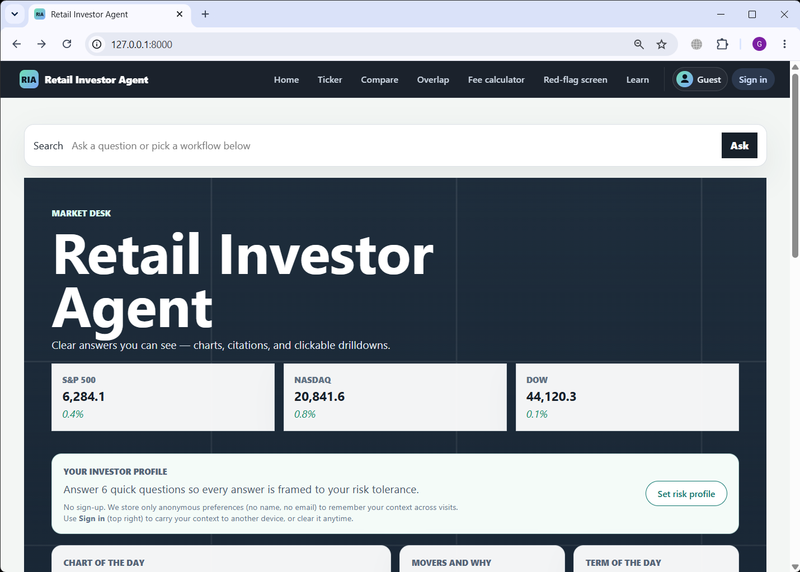</a>
  <a href="img/landing-questions.png">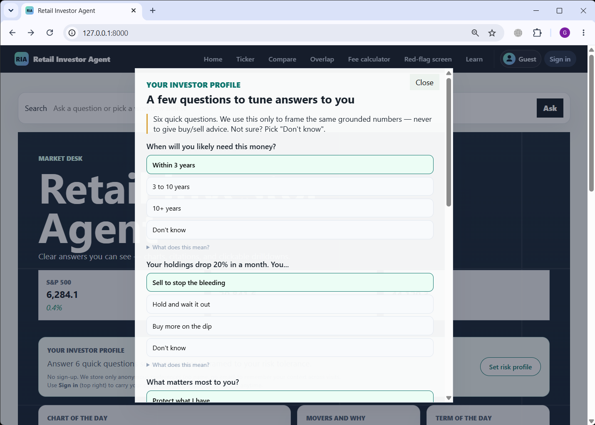</a>
  <a href="img/landing-market-map.png">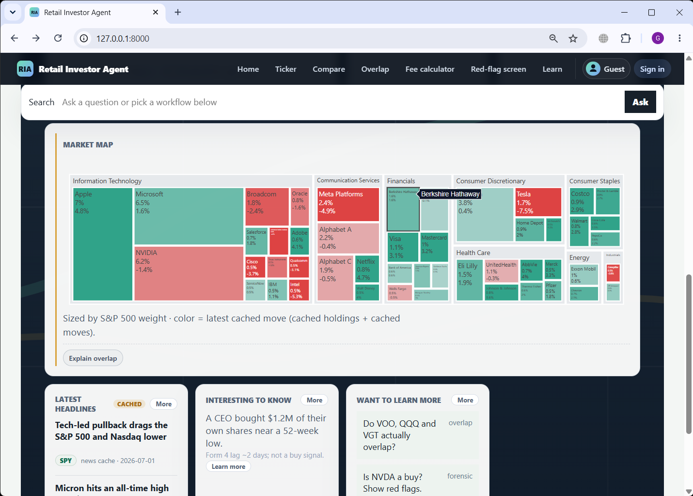</a>
  <a href="img/landing-sign-in.png">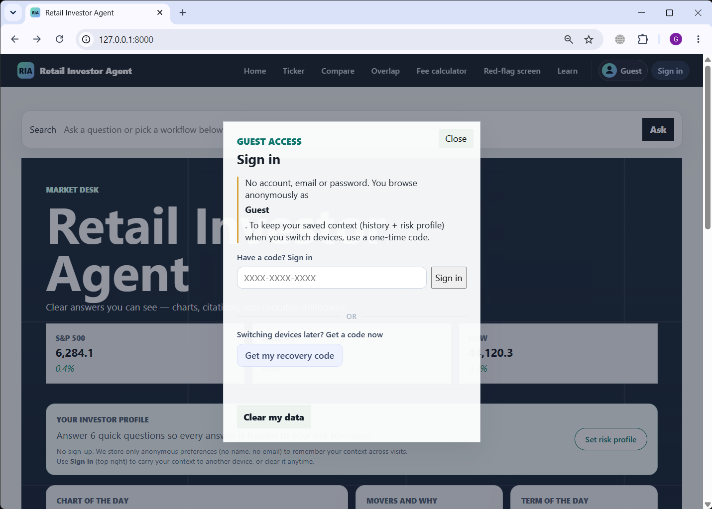</a>
  <a href="img/ticker-card.png">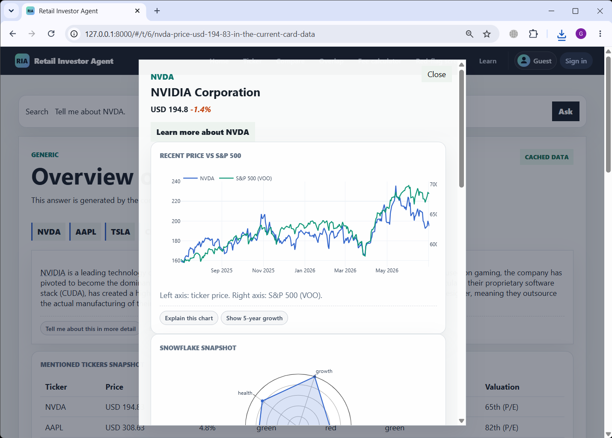</a>
  <a href="img/learn-term.png">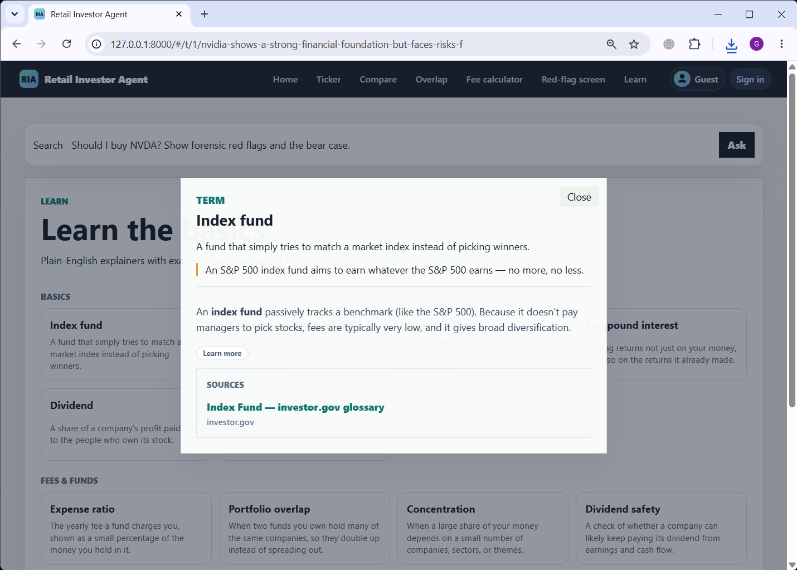</a>

### Full pages (scroll-captured)

The full length of a single answer — top to bottom of the panel — in menu order:

  <a href="img/landing-full.png">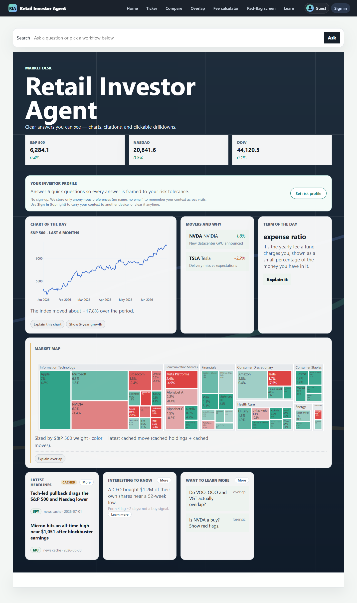</a>
  <a href="img/ticker-full.png">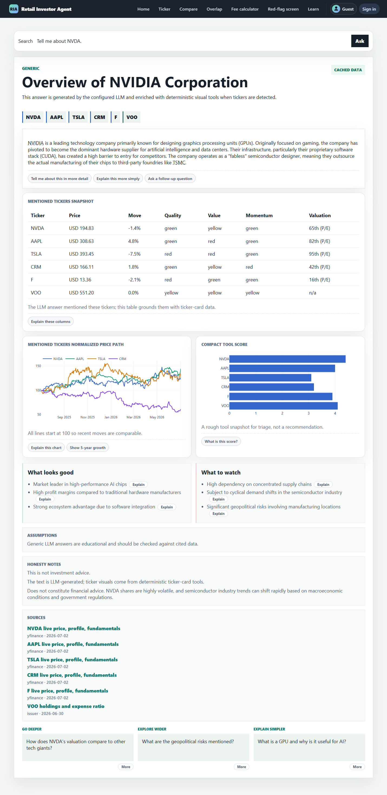</a>
  <a href="img/compare-full.png">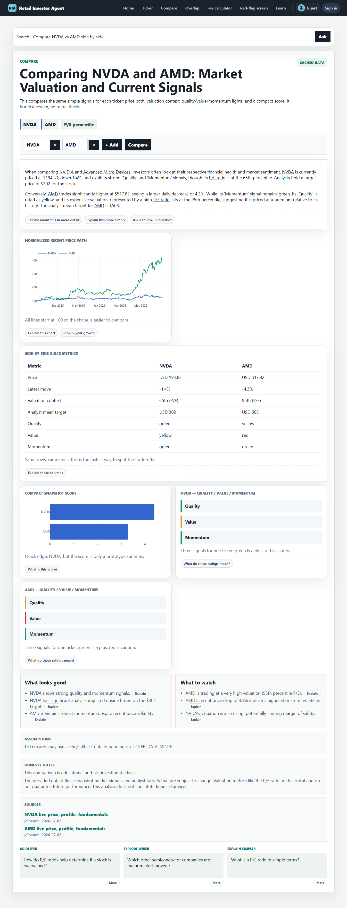</a>
  <a href="img/overlap-full.png">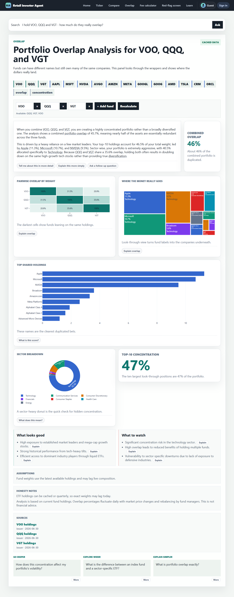</a>
  <a href="img/fee-calc-full.png">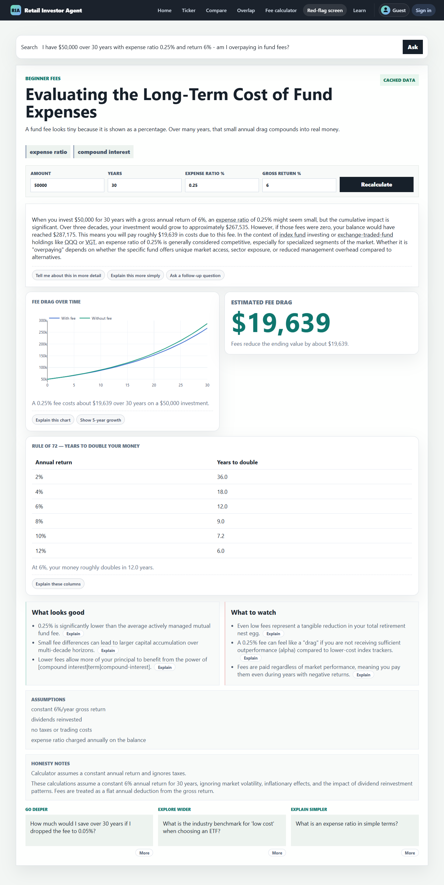</a>
  <a href="img/red-flag-full.png">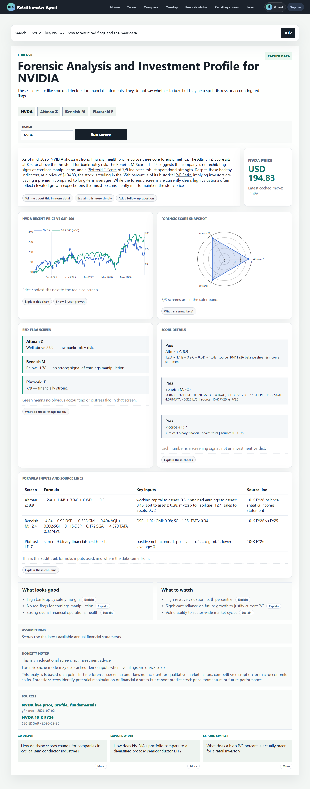</a>
  <a href="img/learn-full.png">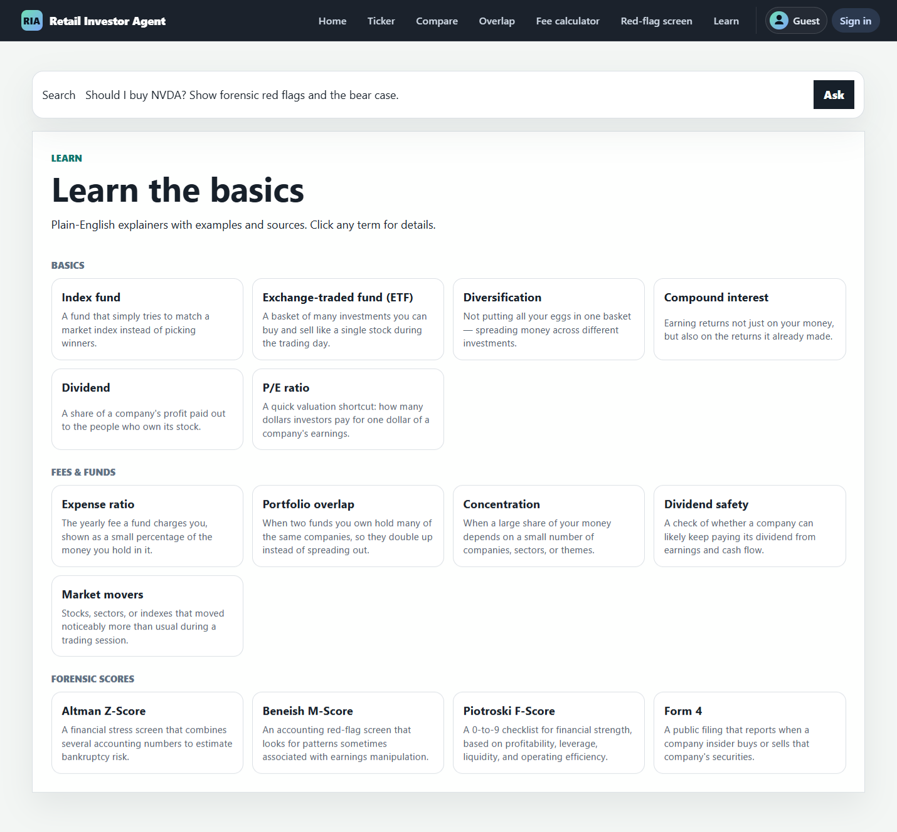</a>

### Screen-recordings

Short clips of live sessions, in menu order:

<table>
  <tr>
    <td width="320"><video src="https://github.com/user-attachments/assets/3ee41135-8798-4161-ab59-3a5c98fd7a0b" controls width="320"></video> Landing → “learn more” (insiders)</td>
    <td width="320"><video src="https://github.com/user-attachments/assets/ad868a75-bef8-4945-9eb8-6006c811bbe0" controls width="320"></video> Set risk profile</td>
  </tr>
  <tr>
    <td width="320"><video src="https://github.com/user-attachments/assets/55b75b0a-5e98-4ea4-b88b-ee2c55e7d446" controls width="320"></video> Ticker card — chart & pros</td>
    <td width="320"><video src="https://github.com/user-attachments/assets/870fbeae-5b6e-4e7b-abb3-86d8338d3d14" controls width="320"></video> Ticker — go deeper</td>
  </tr>
  <tr>
    <td width="320"><video src="https://github.com/user-attachments/assets/29580f91-2505-4f2a-a856-4effeafec806" controls width="320"></video> Compare stocks</td>
    <td width="320"><video src="https://github.com/user-attachments/assets/5fc4415a-4589-4b32-99af-9a2721950dd4" controls width="320"></video> ETF overlap + follow-up</td>
  </tr>
  <tr>
    <td width="320"><video src="https://github.com/user-attachments/assets/f3185ddc-6217-4ae8-b04f-77ebe8d9614a" controls width="320"></video> Forensic red-flag screen</td>
    <td width="320"><video src="https://github.com/user-attachments/assets/3b7e9ac5-1784-46db-89fd-48680054855b" controls width="320"></video> Ask: reliable dividends</td>
  </tr>
</table>

---

## 7. Feature walkthrough

### 7.1 Landing — a "market desk", not an empty chat
Market-map heatmap of mega-caps, live/seed news, and **freshly generated demo
questions** tied to today's movers — each question wired to a specific agent
feature. *(See `landing-*` shots and the landing clip in §6.)*

### 7.2 ETF overlap — the flagship "wow"
*"I hold VOO, QQQ and VGT — how much do they really overlap?"* → an overlap
heatmap, a look-through treemap into real companies, a shared-holdings bar with
weights, and a sector donut. The takeaway ("your three funds are ~X% the same
mega-caps") lands in five seconds. *(See `overlap-full` and the overlap clip in §6.)*

### 7.3 Forensic red-flag screen
*"Should I buy NVDA? Show forensic red flags and the bear case."* → Altman Z /
Beneish M / Piotroski F scores, each with its **formula and citation**, a
radar/snowflake and traffic lights, and a mandatory **bull vs bear** panel. It's
a *screen, not a verdict* — stated plainly. *(See `red-flag-full` and the red-flag clip in §6.)*

### 7.4 Ticker card & fee-drag calculator
Click any company → a dense 1-year chart with an S&P (VOO) baseline on the second
axis and KPI plates. Ask about fees → a two-line fee-drag curve showing what the
expense ratio costs over time. *(See `ticker-card`, `ticker-full`, `fee-calc-full`
and the ticker clips in §6.)*

### 7.5 Glossary, clickable entities & concierge follow-ups
A jargon question returns an ELI5 glossary card with an investor.gov link. Inline
tickers/terms are clickable. Follow-ups come in three kinds (deeper / wider /
simpler), and one is **personalized** from what you looked at earlier this
session. *(See `learn-term`, `learn-full` in §6.)*

---

## 8. Demo path (for the video / live walkthrough)

1. **Landing** — market-desk shelves + generated demo questions.
2. **ETF overlap** (`VOO, QQQ, VGT`): heatmap + treemap + shared holdings + donut.
3. Click a company → **ticker card** (dense 1-year chart from the seed catalog).
4. **Forensic** red-flag screen for `NVDA` / `TSLA`: scores, bear-case, citations.
5. **Fee-drag** calculator: change amount / years / fee / return.
6. A **jargon** question → glossary card; a follow-up shows the **concierge memory**.

---

## 9. Safety, privacy & honest limits

- **Read-only.** The agent informs; it never places a trade or touches an account.
- **No PII.** Guests are anonymous UUIDs. Cross-device recovery stores only a
  SHA-256 of a recovery code — nothing to leak. "Clear my data" wipes everything.
- **Grounded.** Every number is tool-computed with a citation; honesty notes flag
  cached data.
- **Injection-guarded** input and a **disclaimer** on every panel.
- **Honest ceiling.** Some data (ETF holdings, forensic inputs) is cached for demo
  reliability; live news/prices are best-effort. We surface this rather than
  present stale data as "now."

## 10. What we deliberately did *not* add

We resisted new live features (broker aggregation, full backtests, insider feeds,
arbitrary Q&A depth) in favor of making the **agent layer real** and the **data
dense and cited**. Scope for this pass: a genuine ADK multi-agent core over
grounded tools — not a demo of everything, done shallowly.

See [`ARCHITECTURE.md`](ARCHITECTURE.md) for the technical design and the
course-concept → file mapping.
